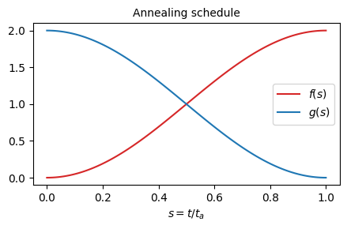

Kibble-Zurek quench in 2D transverse-field Ising model
======================================================

This example provides a quick overview of simulating the real-time
Kibble-Zurek quench in 2D Ising model using **YASTN** library.
We show an example of a system defined on a :math:`4{\times}4`
square lattice with open boundary conditions (OBC). The Hamiltonian reads

.. math::

 H(s) = f(s) \sum_{\langle i, j \rangle} J_{i,j} \sigma^x_i \sigma^x_j - g(s) \sum_i \sigma^z_i,

where :math:`\sigma^x` and :math:`\sigma^z` are standard Pauli matrices,
and we assume random nearest-neighbor couplings :math:`J_{i,j} \in [-1, 1]`.

The amplitude of couplings is gradually turned on as :math:`f(s) = 1 + \sin(\pi (s - 0.5))`,
and the transverse field is gradually turned off as :math:`g(s) = 1 - \sin(\pi (s - 0.5))`.

The system is initialized in the ground (product) state at :math:`s=0`,
where the couplings :math:`f(0)=0`. The evolution ends upon reaching :math:`s=1`,
where transverse field :math:`g(0)=0`.
The quench rate is controlled by an annealing time :math:`t_a` as :math:`s= t / t_a`.
The system gets excited while passing the quantum critical point between
paramagnetic and spin-glass phases in finite annealing time :math:`t_a`.
This provides a minimal example of the problem considered in https://arxiv.org/abs/2403.00910

We compare the results obtained using MPS and PEPS routines.

1. *Initialization of Model Parameters*:
    .. code-block:: python

        import math
        import numpy as np
        import matplotlib.pyplot as plt
        from tqdm import tqdm  # progressbar
        import yastn
        import yastn.tn.mps as mps
        import yastn.tn.fpeps as peps
        from yastn.tn.fpeps.gates import gate_nn_Ising, gate_local_field
        #
        # Employ PEPS lattice geometry for sites and nearest-neighbor bonds
        Lx, Ly = 4, 4  # lattice size
        geometry = peps.SquareLattice(dims=(Lx, Ly), boundary='obc')
        sites = geometry.sites()  # list of lattice sites
        #
        # Draw random couplings from uniform distribution in [-1, 1].
        np.random.seed(seed=0)
        Jij = {k: 2 * np.random.rand() - 1 for k in geometry.bonds()}
        #
        # Define quench protocol
        fXX = lambda s : 1 + math.sin((s - 0.5) * math.pi)
        fZ  = lambda s : 1 - math.sin((s - 0.5) * math.pi)
        ta = 2.0  # annealing time
        dt = 0.04  # intended time step; make it smaller to decrease errors
        steps = round(ta / dt)  # enforce integer number of Trotter steps
        dt = ta / steps
        #
        # Load operators. Problem has Z2 symmetry, which we impose.
        ops = yastn.operators.Spin12(sym='Z2')

2. *PEPS simulations; time evolution*:
    .. code-block:: python

        def gates_Ising(Jij, fXX, fZ, s, dt, sites, ops):
            """ Trotter gates at time s. """
            nn, local = [], []
            # time-step is 1j * dt / 2, as trotterized evolution is
            # completed by its adjoint for 2nd order time-evolution method.
            dt2 = 1j * dt / 2
            for bond, J in Jij.items():
                gt = gate_nn_Ising(J * fXX(s), dt2, ops.I(), ops.x(), bond)
                nn.append(gt)
            for site in sites:
                gt = gate_local_field(fZ(s), dt2, ops.I(), ops.z(), site)
                local.append(gt)
            return peps.Gates(nn=nn, local=local)
        #
        # Initialize system in the product ground state at s=0.
        psi = peps.product_peps(geometry=geometry, vectors=ops.vec_z(val=1))
        #
        # simulation parameters
        D = 6  # PEPS bond dimension
        opts_svd_ntu = {"D_total": D}
        #
        env = peps.EnvNTU(psi, which='NN+')
        # The environment used to calculate bond metric tensor.
        # This is a setup for NTU NN+ environment as described in
        # the appendix of https://arxiv.org/abs/2403.00910
        #
        infoss = []  # for diagnostics information
        #
        # execute time evolution
        t = 0
        for _ in tqdm(range(steps)):
            t += dt / 2
            gates = gates_Ising(Jij, fXX, fZ, t / ta, dt, sites, ops)
            infos = peps.evolution_step_(env, gates, opts_svd=opts_svd_ntu)
            # The state psi is contained in env
            # evolution_step_ updates psi in place.
            infoss.append(infos)
            t += dt / 2

        Delta = peps.accumulated_truncation_error(infoss, statistics='mean')
        print(f"Accumulated mean truncation error: {Delta:0.5f}")

3. *PEPS simulations; final correlations*:
    .. code-block:: python

        # We employ boundary MPS to contract the network
        opts_svd_env = {'D_total': 4 * D}
        opts_var_env = {"max_sweeps": 8,
                        "overlap_tol": 1e-5,
                        "Schmidt_tol": 1e-5}
        #
        # setting-up environment
        env_mps = peps.EnvBoundaryMps(psi,
                                      opts_svd=opts_svd_env,
                                      opts_var=opts_var_env, setup='lr')
        #
        # Calculating 1-site <Z_i> for all sites
        Ez_peps = env_mps.measure_1site(ops.z())
        #
        # Calculating 2-site <X_i X_j> for all pairs i <= j
        Exx_peps = env_mps.measure_2site(ops.x(), ops.x(),
                                         opts_svd=opts_svd_env,
                                         opts_var=opts_var_env)

4. *MPS simulations*:
    .. code-block:: python

        # Map between sites and linear MPS ordering.
        s2i = {s: i for i, s in enumerate(sites)}
        #
        # Map for bonds, sorting pairs of MPS indices for convinience
        b2i = lambda s1, s2: tuple(sorted([s2i[s1], s2i[s2]]))
        #
        # define Hamiltonian MPO
        HI = mps.product_mpo(ops.I(), N=Lx*Ly)  # identity MPO
        #
        termsXX = [mps.Hterm(amplitude=J,
                             positions=[s2i[s1], s2i[s2]],
                             operators=[ops.x(), ops.x()]) \
                    for (s1, s2), J in Jij.items()]
        HXX = mps.generate_mpo(I, termsXX)
        #
        termsZ = [mps.Hterm(-1, i, ops.z()) for i in range(Lx * Ly)]
        HZ = mps.generate_mpo(I, termsZ)
        #
        # MPO contributions in H(t) will be added up.
        H = lambda t: [HXX * fXX(t / ta), HZ * fZ(t / ta)]
        #
        # Initial state. TDVP is unstable starting in a product state
        # There are many strategies to mitigate it.
        # Here, a simple strategy to start with a product state obtained
        # via DMRG with artificially enlarged bond dimension is sufficient.
        psi = mps.random_mps(HI, D_total=16)  # initialize with D=16
        mps.dmrg_(psi, H(0), method='1site', max_sweeps=8, Schmidt_tol=1e-8)
        #
        # time-evolution generator and its parameters
        opts_expmv = {'hermitian': True, 'tol': 1e-12}
        opts_svd = {'tol': 1e-6, 'D_total': 64}  # max MPS bond dimension
        evol = mps.tdvp_(psi, H, times=(0, ta),
                        method='12site', dt=dt, order='2nd',
                        opts_svd=opts_svd, opts_expmv=opts_expmv,
                        progressbar=True)
        #
        # run evolution
        # evol is a generator with one (final) snapshot to reach
        next(evol)
        #
        # calculate expectation values
        Ez_mps = mps.measure_1site(psi, ops.z(), psi)
        Exx_mps = mps.measure_2site(psi, ops.x(), ops.x(), psi, bonds="<=")

5. *Compare results of PEPS and MPS*:
    .. code-block:: python

        Z_peps = np.array([Ez_peps[st].real for st in sites])
        Z_mps = np.array([Ez_mps[s2i[st]].real for st in sites])
        error_Z = np.linalg.norm(Z_peps - Z_mps) / np.linalg.norm(Z_mps)
        print(f"Relative difference of PEPS vs MPS in Z magnetization: {error_Z:0.5f}")

        # Euclidian distance on a square lattice
        dist = lambda s1, s2: np.linalg.norm([s1[0]-s2[0], s1[1]-s2[1]])
        rs = np.array([dist(s1, s2) for (s1, s2) in Exx_peps])
        #
        XX_peps = np.array([*Exx_peps.values()]).real
        XX_mps = np.array([Exx_mps[b2i(*bond)] for bond in Exx_peps.keys()]).real
        error_XX = np.linalg.norm(XX_peps - XX_mps) / np.linalg.norm(XX_mps)
        print(f"Relative difference of PEPS vs MPS in XX correlations: {error_XX:0.5f}")

5. *Visualize*:
    .. code-block:: python

        fig, ax = plt.subplots(1, 2)
        fig.set_size_inches(8, 4)
        plt.subplots_adjust(hspace=0.3, wspace=0.3)
        ax[0].scatter(rs, XX_peps, label='PEPS',
                    marker='+', color='r')
        ax[0].scatter(rs, XX_mps, label='MPS',
                    marker='o', color='b', facecolors='none')
        ax[0].set_ylim([-1.05, 1.05])
        ax[0].set_xlabel(r"distance $||i - j||$")
        ax[0].set_ylabel(r"two-point correlations $\langle X_i X_j \rangle$")
        ax[0].legend()
        ax[1].scatter(np.arange(len(Z_peps)), Z_peps, label='PEPS',
                        marker='+', color='r')
        ax[1].scatter(np.arange(len(Z_mps)), Z_mps, label='MPS',
                        marker='o', color='b', facecolors='none')
        ax[1].set_xlabel(r"linear site index i")
        ax[1].set_ylabel(r"transverse magnetization $\langle Z_i \rangle$")
        ax[1].set_ylim([-1.05, 1.05])
        fig.suptitle(f"{Lx}x{Ly} lattice; annealing_time = {ta:0.1f}")
        fig.show()

    .. image:: corr_4x4_ta=2.0.png
