Handling swap gates in einsum
=============================

:meth:`yastn.ncon` and :meth:`yastn.einsum` (which differ only by syntax) contract a
network of tensors pairwise.  Their ``swap`` argument lists pairs of lines, i.e., legs
labelled by their ``ncon`` index, that cross in the fermionic order of the network; each pair
contributes a fermionic swap gate.  This page describes how ``ncon`` places those swap gates,
including gates on lines that are about to be contracted, so that the result does not depend
on the order of contractions.

Plan and execution
------------------

``ncon`` first builds a *plan*, a tuple of commands, from the index labels alone, and then
executes it on the tensors.  The plan never looks at tensor data and is cached, so the same
plan serves every call with the same ``inds``, ``order`` and ``swap``.

======================  ======================================================================
command                 action
======================  ======================================================================
``tensordot``           contract two tensors (an empty pair of axes is an outer product)
``trace``               contract pairs of legs of one tensor
``swap_gate``           apply swap gates between pairs of legs of one tensor
``parity_sign``         apply the parity string of a jump move
``tensordot_psplit``    ``tensordot`` that records the parity of some contracted legs (gadget)
``trace_psplit``        ``trace`` that records the parity of some contracted legs (gadget)
``transpose``           order the outgoing legs
======================  ======================================================================

A plan can be printed for inspection::

    from yastn.tensor._einsum import _meta_ncon

    inds = ((1, 2, 3), (1, 2, 4), (3, 5), (4, 5))
    for command in _meta_ncon(inds, None, ((1, 5),)):  # inds, order, swap
        print(command)

Tensors are numbered by their position in the list passed to ``ncon``; each contraction
result gets the next free number.  Legs are numbered by their position on the current tensor.

Swap gates on lines of the network
----------------------------------

A swap gate between lines :math:`a` and :math:`b` multiplies each block by

.. math::

   (-1)^{p(a) \cdot p(b)}, \qquad p(a) \cdot p(b) = \sum_i p_i(a)\, p_i(b),

where :math:`p_i(a)` is the parity of the :math:`i`-th charge component carried by line
:math:`a`, and the sum runs over the components selected by the ``fermionic`` flag of the
:ref:`tensor configuration <tensor/configuration:yastn configuration>`.  The sign depends only
on the charges carried by the two lines, so the gate can be applied on any tensor that has both
lines as legs.  While planning, a pair whose lines end on a common tensor is applied there with
``swap_gate``; the other pairs wait until contractions bring their lines onto one tensor.

A pair is a *bad swap* when one of its lines is contracted in the current step and the other
line touches neither of the two tensors being contracted: after the step the first line is gone
and the gate has nowhere to go.  Every bad swap is removed exactly before the step, by jump
moves where possible and by a parity gadget otherwise.

**Diagrams.**  In the figures below circles are tensors and black lines are their legs, labelled
by the ``ncon`` index.  A red dot marks a swap gate between the two lines crossing there; lines
drawn across each other with a gap cross without a swap gate.  A blue square labelled
:math:`P_T` on a line :math:`d` is the parity string :math:`(-1)^{P_T \cdot p(d)}` of tensor
:math:`T`, where :math:`P_T` is the parity of the total charge ``T.n``; this is what
``('parity_sign', T, ...)`` applies, via :meth:`yastn.swap_gate` with ``charge=T.n``.

Jump move
---------

A symmetric tensor :math:`T` with legs :math:`l_1, \dots, l_m` satisfies, for any line
:math:`d`,

.. math::

   \prod_{j=1}^{m} \mathrm{swap}(l_j, d) = (-1)^{P_T \cdot p(d)},

because on every block of :math:`T` the parities of the legs add up to :math:`P_T`.  Moving
line :math:`d` across :math:`T` therefore trades the swap gate with one leg for swap gates with
all the other legs and a parity string on :math:`d`.  A self-loop of :math:`T` (a pair of legs
still to be traced, or a gadget pair) appears twice in the product and drops out.

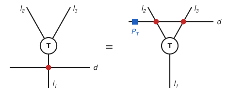
         with the parity string of T on d.

   Jump move over :math:`T`:
   :math:`\mathrm{swap}(l_1, d) = \mathrm{swap}(l_2, d)\, \mathrm{swap}(l_3, d)\, (-1)^{P_T \cdot p(d)}`.

Resolving the bad swaps of one step
-----------------------------------

Consider a step contracting tensors :math:`P` and :math:`Q` over lines
:math:`e_1, \dots, e_K`; for a trace :math:`P = Q`.  Let :math:`H` be the rest of the network:
the other tensors and the lines between them, with every open line ending on a fixed external
vertex. Lines connecting :math:`P` or :math:`Q` to any of the other tensorsare are not included in :math:`H`,
because any swap gates there are not bad swap gates. Every bad swap of the step therefore pairs a
contracted line :math:`e_k` with a line :math:`L` of :math:`H`.  The following notions describe them.

Symmetric difference
   For sets :math:`A` and :math:`B`, :math:`A + B = (A \cup B) \setminus (A \cap B)` is the set
   of elements in exactly one of them.  A swap gate applied twice cancels, so applying a set of
   swap gates on top of the present ones leaves their symmetric difference.

Rows and columns
   The bad swaps form a table with one row per contracted line :math:`e_k` and one column per
   line :math:`L` of :math:`H`, with an entry where :math:`\mathrm{swap}(e_k, L)` is present (see
   :ref:`the example below <einsum-rows>`).  Row :math:`k` is the set of lines
   :math:`Y_k = \{ L \in H : \mathrm{swap}(e_k, L) \text{ is present} \}`; column :math:`L` is
   the set of contracted lines whose swap with :math:`L` is present.  The step can proceed once
   every row is empty.

Coboundary
   For a set :math:`F` of tensors of :math:`H`, :math:`\delta F` is the set of lines of
   :math:`H` with exactly one end on a tensor of :math:`F`; the external vertex is never in
   :math:`F`.  For a single tensor, :math:`\delta T = \delta \{T\}` is the set of legs of
   :math:`T` that are lines of :math:`H`, self-loops excluded. Physically, :math:`\delta F`
   represents the field generated from the source :math:`F`.

Cut
   A set :math:`D` of lines of :math:`H` is a cut if :math:`D = \delta F` for some set
   :math:`F` of tensors of :math:`H`.  Equivalently, the tensors of :math:`H` can be coloured
   with two colours, the external vertex keeping the first, so that the lines joining different
   colours are exactly those of :math:`D`; the tensors of the second colour then form
   :math:`F`.  Since :math:`\delta F + \delta F' = \delta (F + F')`, the symmetric difference of
   two cuts is a cut.

Class
   Rows :math:`k` and :math:`k'` are in the same class if they differ by a coboundary,
   :math:`Y_k + Y_{k'} = \delta F` for some set :math:`F` of tensors of :math:`H`, i.e., if
   :math:`Y_k + Y_{k'}` is a cut.  This is an equivalence relation: :math:`\delta \emptyset =
   \emptyset`, the symmetric difference is symmetric, and
   :math:`(Y_k + Y_{k'}) + (Y_{k'} + Y_{k''}) = Y_k + Y_{k''}` is a cut when both terms are.  The
   class of row :math:`k` consists of the rows :math:`Y_k + D` with :math:`D` a cut.

Two kinds of jump move change the rows.

**Row jump.**  A jump over a tensor :math:`T` of :math:`H`, with partner line :math:`e_k`,
changes row :math:`k` by the coboundary of :math:`T`, :math:`Y_k \to Y_k + \delta T`.  The swap
gates it creates between
:math:`e_k` and the lines from :math:`T` to :math:`P` or :math:`Q` have both lines on
:math:`P` or :math:`Q`, and are applied there before the step (therefore not included in :math:`delta T`).

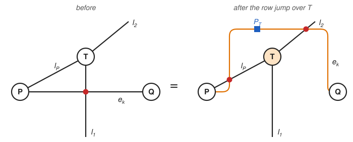
         l_2 and l_P of T, with the parity string of T on e_k.

   Row jump over :math:`T` with partner :math:`e_k`.  Line :math:`e_k` passes over :math:`T`:
   the swap :math:`(e_k, l_1)` is traded for :math:`(e_k, l_2)`, :math:`(e_k, l_P)` and the
   parity string :math:`P_T` on :math:`e_k`.  The swap :math:`(e_k, l_P)` has both lines on
   :math:`P` and is applied there; row :math:`k` changes by :math:`\delta T = \{l_1, l_2\}`.

**Column jump.**  A jump over :math:`P` (or :math:`Q`), with partner line :math:`L \in H`,
changes column :math:`L`, toggling :math:`L` in every row at once: :math:`Y_k \to Y_k + \{L\}`
for all :math:`k`.  It also creates swap
gates between :math:`L` and the uncontracted legs of :math:`P`, which are ordinary swaps for
later steps.  For a trace the contracted lines are self-loops of :math:`P`, and a column jump
changes no row.

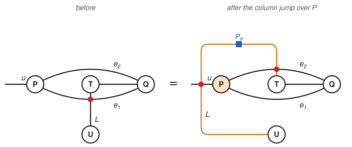
         uncontracted leg u of P, with the parity string of P on L.

   Column jump over :math:`P` with partner :math:`L`, for :math:`K = 2`.  Line :math:`L` passes
   over :math:`P`: the swap :math:`(e_1, L)` is traded for :math:`(e_2, L)`, :math:`(u, L)` and
   the parity string :math:`P_P` on :math:`L`.  :math:`L` leaves row 1 and enters row 2, while
   :math:`(u, L)` involves the uncontracted leg :math:`u` of :math:`P` and waits for a later step.

**Which rows can be emptied.**  Row jumps over the tensors of a set :math:`F` change a row by the
cut :math:`\delta F`, which keeps the row in its class, and a column jump changes all rows by the
same set, which keeps every :math:`Y_k + Y_{k'}`.  No jump therefore changes which rows share a
class.  Rows that can be emptied together must end up equal, so they must have been in one class from the
start.  Conversely, the rows of one class can be emptied together: row jumps first make them
equal, and column jumps then empty them all.  A trace step has no column jumps, so only the class
of :math:`\emptyset`, i.e., the rows that are cuts themselves, can be emptied.

**From jumps to a 2-colouring.**  To bring row :math:`k` onto the representative row :math:`r`
of its class, the planner needs tensors of :math:`H` whose row jumps, all with partner
:math:`e_k`, change row :math:`k` by :math:`D = Y_k + Y_r`.  Jumping over the tensors of a set
:math:`F` changes the row by :math:`\delta F`. Record the choice of :math:`F` as a colour,
:math:`c_T = 1` for :math:`T \in F` and :math:`c_T = 0` for other tensors in :math:`H`,
and give the external vertex of every open line the colour 0, as it cannot be jumped over.
A line :math:`L` between tensors :math:`S` and :math:`T` lies in
:math:`\delta F` exactly when :math:`c_S \neq c_T`, so :math:`\delta F = D` becomes one condition
per line of :math:`H`,

.. math::

   c_S + c_T \equiv [L \in D] \pmod 2 ,

where :math:`[L \in D]` is 1 for :math:`L \in D` and 0 otherwise: the colour has to change
across the lines of :math:`D` and stay the same across all other lines.  The planner solves these
conditions by propagating colours along the lines of :math:`H`, starting from one tensor in each
connected part.  A line whose ends already carry colours that violate its condition shows that
no :math:`F` exists, and row :math:`k` then does not belong to the class.
Otherwise the colouring is the list of jumps: one row jump with partner
:math:`e_k` over every tensor of colour 1.  In a connected part with an open line the colours are
fixed by the external vertex.  In a part without open lines the two colours can be exchanged,
which replaces the tensors to jump over by all the other tensors of that part; both choices
change the row by :math:`D`, and the planner takes the one with fewer tensors of colour 1, i.e.,
fewer jumps and parity strings (on a tie, the one that keeps the starting tensor at colour 0).

**Example.**  The remaining illustrations follow the first step of ::

    yastn.ncon([P, Q, C, D, E], [(1, 2), (1, 2), (3, 4), (3, 5), (4, 5, 0)], swap=[(1, 3), (2, 4)])

which contracts :math:`P` and :math:`Q` over :math:`e_1` and :math:`e_2` (lines 1 and 2).  The
rest of the network, :math:`H`, has the tensors ``C``, ``D``, ``E``, the lines :math:`x`,
:math:`y`, :math:`z` (lines 3, 4, 5) and the open line :math:`w` of ``E``.  The two bad swaps
give the rows :math:`Y_1 = \{x\}` and :math:`Y_2 = \{y\}`.  The colouring for
:math:`D = Y_1 + Y_2 = \{x, y\}` starts at ``E``, whose colour 0 is fixed by its open line
:math:`w`.  Line :math:`y \in D` gives :math:`c_C = 1`, line :math:`z \notin D` gives
:math:`c_D = 0`, and line :math:`x \in D`, between ``C`` and ``D``, is consistent.  Hence
:math:`D = \delta C` is a cut, and row 2 is brought onto row 1 by a single row jump over ``C``.

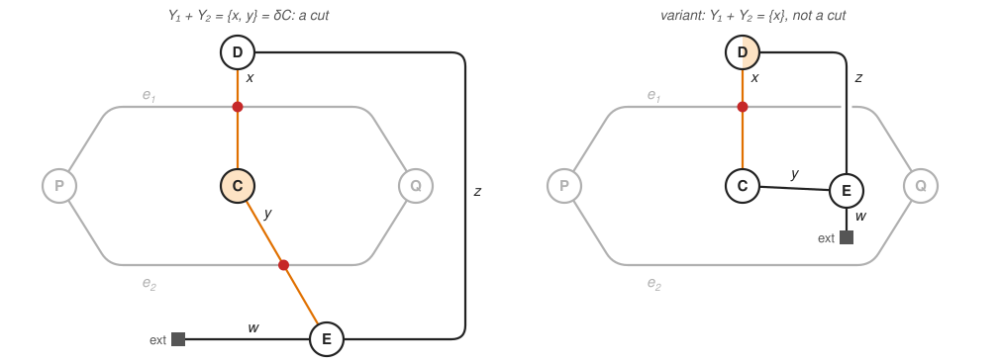
         line z crosses e_1 without a swap gate and tensor D would need both colours.

   The tensors of :math:`H` coloured for the cut test; :math:`P`, :math:`Q` and the contracted
   lines are grey.  Left: colouring ``C`` alone changes the colour exactly across :math:`x` and
   :math:`y` (orange), so :math:`\{x, y\} = \delta C` is a cut.  Right: had the only bad swap
   been :math:`(e_1, x)`, the rows would differ by :math:`\{x\}`, and the colour would have to
   change across :math:`x` but not across :math:`y` and :math:`z`.  As :math:`x, y, z` form a
   cycle, ``D`` cannot satisfy both; in the drawing, :math:`z` has to cross :math:`e_1` without
   a swap gate.

**Recipe.**  The planner groups the rows into classes, each represented by its first row.  Since
no jump moves a row out of its class, at most one class can be emptied in a step.  The planner
chooses this *emptied class* as the largest one, so that the fewest rows need a gadget (on a tie,
the class whose first row comes first; for a trace, the class of the empty row, i.e., the rows
that are cuts), and emits

#. row jumps that bring every row of the emptied class onto its representative row,
#. column jumps, over whichever of :math:`P` and :math:`Q` has fewer uncontracted legs
   (:math:`P` on a tie), one for each line of the representative row,

each group followed by ``swap_gate`` commands for the pairs that now sit on one tensor.  Rows
outside the emptied class get a parity gadget.  Any other row of the class, or any set of lines that
differs from it by a cut, would serve equally well as the representative: the result is the same,
and only the number of jumps changes.

In the example both rows form one class, represented by row 1.  The figures show the network
and its table of bad swaps after each group of jumps.

.. _einsum-rows:

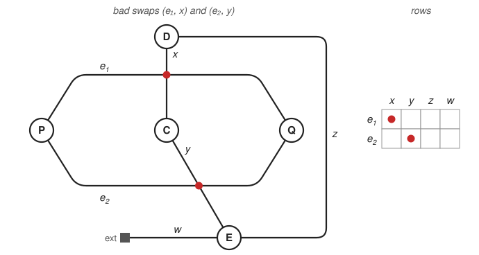
         at row e_1, column x and row e_2, column y.

   The example and its table: row :math:`e_k` has a red dot in column :math:`L` when line
   :math:`L` crosses :math:`e_k` with a swap gate, so :math:`Y_1 = \{x\}` and
   :math:`Y_2 = \{y\}`.

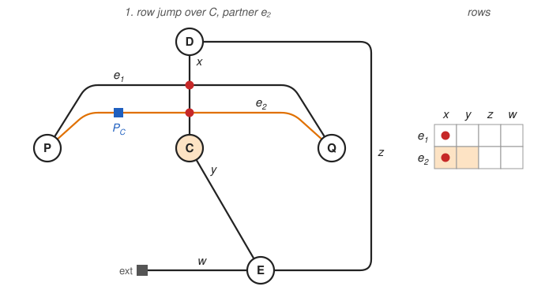
         table has dots in column x of both rows.

   Row jump over ``C`` (the set :math:`F` of the cut test) with partner :math:`e_2`: line
   :math:`e_2` passes over ``C``, stops crossing :math:`y`, starts crossing :math:`x` and carries
   the parity string :math:`P_C`.  In the table, :math:`\delta C = \{x, y\}` is added to row 2
   (shaded cells), which now equals the representative row 1.

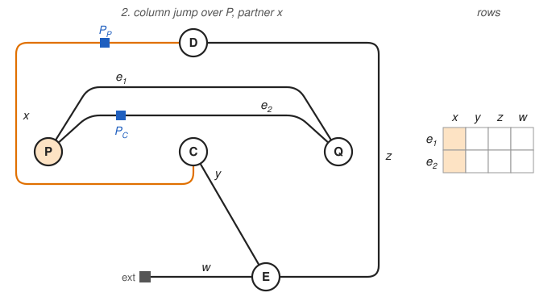
         the table is empty.

   Column jump over :math:`P` with partner :math:`x`, the only line of the representative row;
   :math:`P` and :math:`Q` have no uncontracted legs, so the tie goes to :math:`P`.  Line
   :math:`x` passes around :math:`P` and carries the parity string :math:`P_P`.  In the table,
   column :math:`x` is toggled in both rows, which are now empty, and the step can proceed.

The plan of the example starts with exactly these two jumps::

    ('parity_sign', 2, 0, (1,))                  # row jump over C: string P_C on leg 1 of P (e_2)
    ('parity_sign', 0, 2, (0,))                  # column jump over P: string P_P on leg 0 of C (x)
    ('tensordot', 5, (0, 1), ((0, 1), (0, 1)))   # P.Q over e_1 and e_2

The rows that can't be emptied are worked out in :ref:`einsum-cycle` below.

Parity gadget
-------------

After the jumps, each row outside the emptied class still holds bad swaps :math:`(e_k, L)`.  No jump
can empty it, as jumps do not move a row out of its class, and the sign
:math:`(-1)^{p(e_k) \cdot p(L)}` of such a swap depends on the parity of the contracted line,
which the step sums over.  A parity gadget carries that parity past the step; each row outside
the emptied class gets one.

**Splitting by parity.**  The identity on line :math:`e_k` is the sum of the projectors
:math:`\Pi_p` onto its sectors of parity :math:`p`.  On the sector :math:`p` the swap gate
:math:`(e_k, L)` reduces to the parity string :math:`(-1)^{p \cdot p(L)}` on :math:`L`: a gate on
a line that survives the step, but a different one for each :math:`p`.

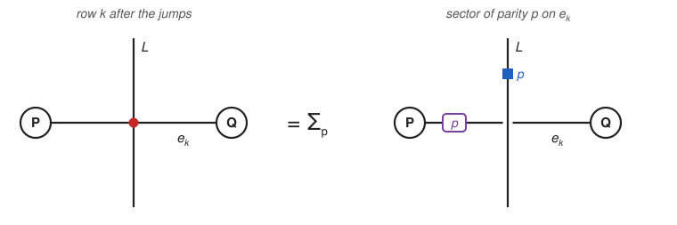
         parity p, the lines crossing without a swap gate, and a parity string of charge p on L.

   Left: a bad swap of a row outside the emptied class.  Right: one term of the sum over the parity
   :math:`p` of :math:`e_k`.  The purple box restricts :math:`e_k` to parity :math:`p`, the two
   lines cross without a swap gate, and the blue square is the parity string of charge :math:`p`
   on :math:`L`.

**Recording the parity.**  ``tensordot_psplit`` (``trace_psplit`` for a trace) contracts each
sector separately, restricting leg :math:`e_k` of :math:`P`, and appends to each result
:math:`R_p` a pair of one-dimensional legs :math:`(\mathrm{aux}, \mathrm{aux}')` with signatures
:math:`+1` and :math:`-1` and charge :math:`p`; the results are added, :math:`R = \sum_p R_p`.
The pair carries no net charge, so :math:`R` keeps the total charge of :math:`P` and :math:`Q`,
and on each block of :math:`R` the leg :math:`\mathrm{aux}` carries the parity of :math:`e_k`.  A
swap gate between :math:`\mathrm{aux}` and :math:`L` therefore gives the string
:math:`(-1)^{p \cdot p(L)}` of each sector, and every remaining swap :math:`(e_k, L)` is replaced
by :math:`(\mathrm{aux}, L)`.

**Removing the pair.**  :math:`(\mathrm{aux}, L)` is an ordinary swap gate: it waits until
:math:`L` and :math:`\mathrm{aux}` are legs of one tensor and is applied there with
``swap_gate``.  As soon as no swap touches the pair, it is traced.  On each block
:math:`\mathrm{aux}` and :math:`\mathrm{aux}'` carry the same charge, so the trace adds the sectors
back together, now each with its own sign; the final tensor has no gadget legs.

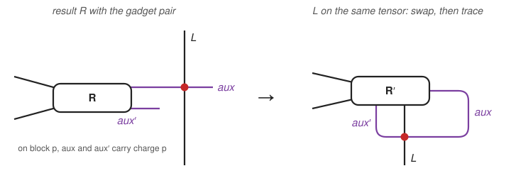
         becomes a leg of the same tensor, the swap gate sits on it and aux and aux' are joined.

   Left: the result :math:`R` of the step with its gadget pair; the swap :math:`(e_k, L)` has
   become :math:`(\mathrm{aux}, L)`.  Right: once :math:`L` is a leg of the same tensor
   :math:`R'`, the swap gate is applied there and the pair is traced, drawn as the closed purple
   line.

**Later steps.**  Until it is traced, the pair is a self-loop of the tensor that carries it.  If
that tensor is :math:`P` or :math:`Q` of a later step, a swap between the pair and a contracted
line has both lines on that tensor and is applied there.  If it is a tensor of :math:`H`, the pair
is a line of :math:`H` that no cut contains, so row jumps cannot change whether a row contains it,
and a row that the column jumps do not free from it gets a gadget of its own.

**In the plan.**  In ``('tensordot_psplit', out, (P, Q), axes, paxes)`` the last entry lists the
legs of :math:`P` whose parity is recorded, one per gadget; their pairs are the last legs of
``out``, in the same order.  The :ref:`cycle example <einsum-cycle>` below follows one gadget
through its plan, from ``tensordot_psplit`` to the ``trace`` of the pair.

**Several charge components and cost.**  With several fermionic charge components the recorded
parity is a vector with one entry per fermionic component, and the split runs over all
:math:`2^{n_f}` of its values.  The sectors are disjoint slices of :math:`P`, so the step adds
contraction calls but no arithmetic.  The parts are added with ``lazy_threshold=1``, so
:math:`R` stores only the blocks some sector fills, as many as the contraction without the
gadget; a plain sum would lay out every block its legs allow, including combinations of
:math:`(\mathrm{aux}, \mathrm{aux}')` with the other legs that no sector produces (about four
times as many elements for one U(1) fermionic charge in a small test).  Later contractions keep
this only when ``lazy_threshold`` is set in the configuration; with lazy off they lay out every
allowed block again until the pair is traced.  Which steps need a gadget depends on the
contraction ``order``.

Examples
--------

In the three networks below tensors ``A, B, C, D`` have numbers ``0, 1, 2, 3``, the default
order contracts ``A`` and ``B`` first, and the swap gate is bad in that step.  The value of
``ncon`` equals the swap gate applied by hand after an outer product that puts both lines on
one tensor.  For the second example, with ``Z2`` fermions::

    import yastn

    cfg = yastn.make_config(sym='Z2', fermionic=True)
    leg = lambda: yastn.Leg(cfg, s=1, t=(0, 1), D=(1, 1))
    l1, l2, l3, l4, l5 = (leg() for _ in range(5))
    A = yastn.rand(cfg, n=1, legs=[l1, l2, l3])
    B = yastn.rand(cfg, n=1, legs=[l1.conj(), l2.conj(), l4])
    C = yastn.rand(cfg, n=1, legs=[l3.conj(), l5])
    D = yastn.rand(cfg, n=1, legs=[l4.conj(), l5.conj()])

    x = yastn.ncon([A, B, C, D], [(1, 2, 3), (1, 2, 4), (3, 5), (4, 5)], swap=[(1, 5)])

    AC = yastn.tensordot(A, C, axes=((), ()))  # lines 1, 2, 3, 3, 5 on one tensor
    AC = AC.swap_gate(axes=(0, 4))              # swap gate between lines 1 and 5
    ref = yastn.ncon([AC, B, D], [(1, 2, 3, 3, 5), (1, 2, 4), (4, 5)])
    assert abs(x.item() - ref.item()) < 1e-12

One row: column jump
^^^^^^^^^^^^^^^^^^^^

``A(1) B(1) C(2) D(2)`` with ``swap=[(1, 2)]``.  The only row, :math:`Y_1 = \{2\}`, is emptied
by a column jump over ``A`` with partner line 2.  ``A`` has no other legs, so line 2 slides past
``A`` and only the parity string of ``A`` remains on line 2.

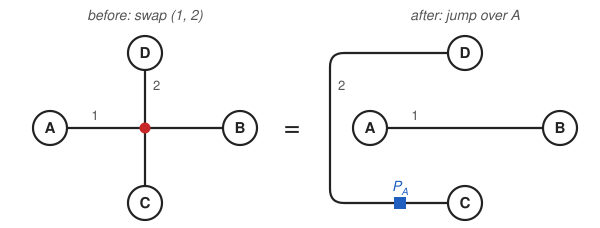
         the parity string of A.

.. code-block:: python

    ('parity_sign', 0, 2, (0,))              # jump over A: string P_A on leg 0 of C (line 2)
    ('tensordot', 4, (0, 1), ((0,), (0,)))   # A.B over line 1
    ('tensordot', 5, (2, 3), ((0,), (0,)))   # C.D over line 2
    ('tensordot', 6, (4, 5), ((), ()))       # outer product of the two scalars

Two rows on a tree: row jump and column jump
^^^^^^^^^^^^^^^^^^^^^^^^^^^^^^^^^^^^^^^^^^^^

``A(1, 2, 3) B(1, 2, 4) C(3, 5) D(4, 5)`` with ``swap=[(1, 5)]``.  The first step contracts
:math:`P =` ``A`` and :math:`Q =` ``B`` over lines 1 and 2.  Lines 3 and 4 end on :math:`P` and
:math:`Q`, so :math:`H` consists of ``C``, ``D`` and line 5.  The bad swap gives the rows
:math:`Y_1 = \{5\}` and :math:`Y_2 = \emptyset`.  The figures below follow the steps of the
planner; in each, the partner line of the jump is orange and the tensor jumped over is shaded.

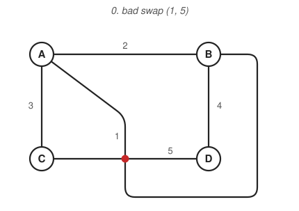

   The network: :math:`Y_1 = \{5\}`, :math:`Y_2 = \emptyset`.

**Classes.**  :math:`Y_1 + Y_2 = \{5\} = \delta D` is a cut of :math:`H`, so rows 1 and 2 form
one class, represented by row 1.

**Row jumps.**  Row 2 is brought onto the representative by a row jump over ``D`` with partner
line 2; ``D`` is the set :math:`F` given by the 2-colouring, as :math:`\delta D = \{5\}`.  Line 2
now passes around ``D``: it crosses both legs of ``D`` and carries the parity string
:math:`P_D`.  The new swap (2, 5) makes :math:`Y_2 = \{5\}`; the new swap (2, 4) has both lines
on ``B`` and is applied there with ``swap_gate``.

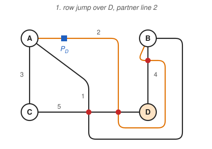

   After the row jump over ``D``: :math:`Y_1 = Y_2 = \{5\}`.

**Column jumps.**  ``A`` and ``B`` keep one uncontracted leg each, so the column jump is over
:math:`P =` ``A``, with partner line 5, the only line of the representative row.  Line 5 now
crosses leg 3 of ``A`` instead of legs 1 and 2, and carries the parity string :math:`P_A`: the
swaps (1, 5) and (2, 5) are removed, and the new swap (3, 5) has both lines on ``C`` and is
applied there with ``swap_gate``.

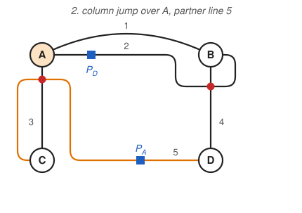
         lines 1 and 2 no longer cross line 5.

   After the column jump over ``A``: :math:`Y_1 = Y_2 = \emptyset`.  Lines 1 and 2 no longer
   cross line 5 and are redrawn shorter.

The bad swap is thus replaced by ordinary swap gates on ``B`` and ``C`` and two parity strings,

.. math::

   \mathrm{swap}(1, 5) = \mathrm{swap}(2, 4)\, (-1)^{P_D \cdot p(2)}\;
   \mathrm{swap}(3, 5)\, (-1)^{P_A \cdot p(5)} .

.. code-block:: python

    ('parity_sign', 3, 0, (1,))     # row jump over D: string P_D on leg 1 of A (line 2)
    ('swap_gate', 1, 1, (1, 2))     # swap (2, 4) on B
    ('parity_sign', 0, 2, (1,))     # column jump over A: string P_A on leg 1 of C (line 5)
    ('swap_gate', 2, 2, (0, 1))     # swap (3, 5) on C
    ('tensordot', 4, (0, 1), ((0, 1), (0, 1)))
    ('tensordot', 5, (2, 4), ((0,), (0,)))
    ('tensordot', 6, (3, 5), ((0, 1), (1, 0)))

.. _einsum-cycle:

Two rows on a cycle: parity gadget
^^^^^^^^^^^^^^^^^^^^^^^^^^^^^^^^^^

Adding line 6 between ``C`` and ``D``, ``A(1, 2, 3) B(1, 2, 4) C(3, 5, 6) D(4, 5, 6)``, puts
line 5 on the cycle ``C-5-D-6``.  A jump over ``C`` or ``D`` toggles lines 5 and 6 together, so
:math:`\{5\}` is not a cut and the two rows fall into different classes.  In the drawing, line 1
cannot reach ``B`` after crossing line 5 without also crossing line 6.  The two classes have one
row each, and on the tie the planner empties the class of row 1:

#. a column jump over ``A`` with partner line 5 empties row 1 and turns the bad swap into
   (2, 5); (3, 5) sits on ``C``;
#. row 2 gets a gadget: ``A.B`` is contracted separately for each parity of line 2, the parity
   is recorded on the gadget pair (aux, aux′) of the result ``AB``, and (2, 5) becomes (aux, 5);
#. once ``C`` is merged with ``AB``, (aux, 5) sits on one tensor and is applied; the gadget pair
   is traced after the last contraction.

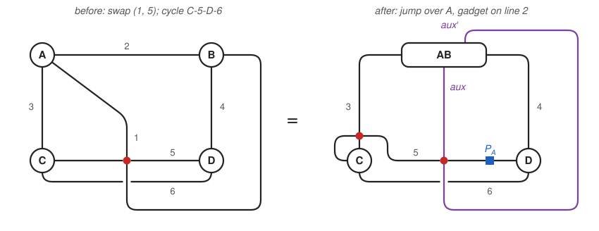
         with a gadget line aux crossing line 5, a swap gate (3, 5) at C and the parity string
         of A on line 5.

.. code-block:: python

    ('parity_sign', 0, 2, (1,))                               # column jump over A: P_A on line 5
    ('swap_gate', 2, 2, (0, 1))                               # swap (3, 5) on C
    ('tensordot_psplit', 4, (0, 1), ((0, 1), (0, 1)), (1,))   # A.B split by the parity of line 2
    ('tensordot', 5, (2, 4), ((0,), (0,)))                    # C.AB, legs (5, 6, 4, aux, aux')
    ('swap_gate', 5, 5, (0, 3))                               # swap (5, aux)
    ('tensordot', 6, (3, 5), ((0, 1, 2), (2, 0, 1)))          # D.(C.AB) over lines 4, 5, 6
    ('trace', 6, 6, ((0,), (1,)))                             # trace the gadget pair

With ``order=(3, 4, 5, 6, 1, 2)`` the same network needs no gadget: lines 1 and 5 reach a common
tensor before line 1 is contracted, and the swap is applied there.
